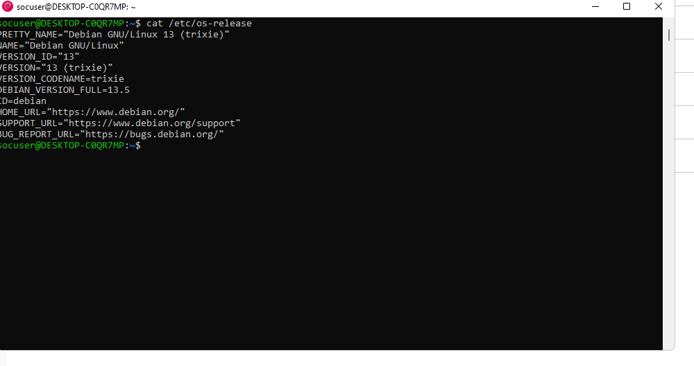
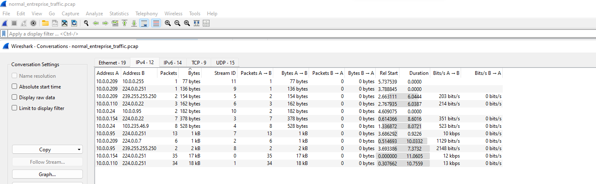
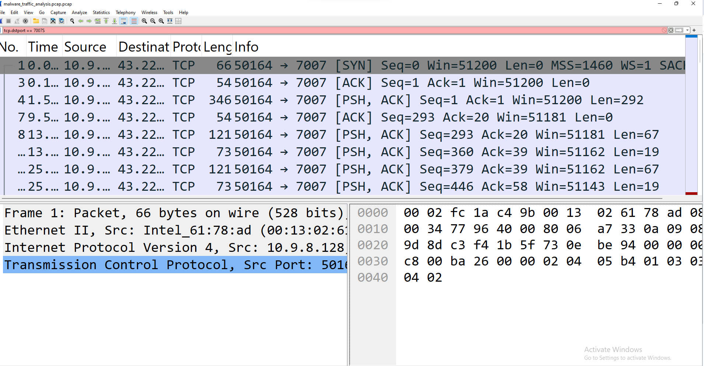
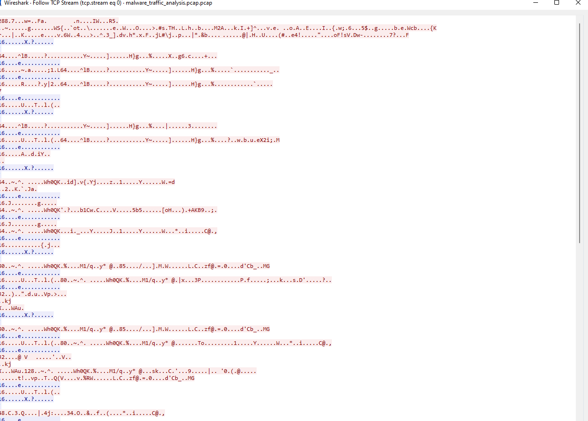
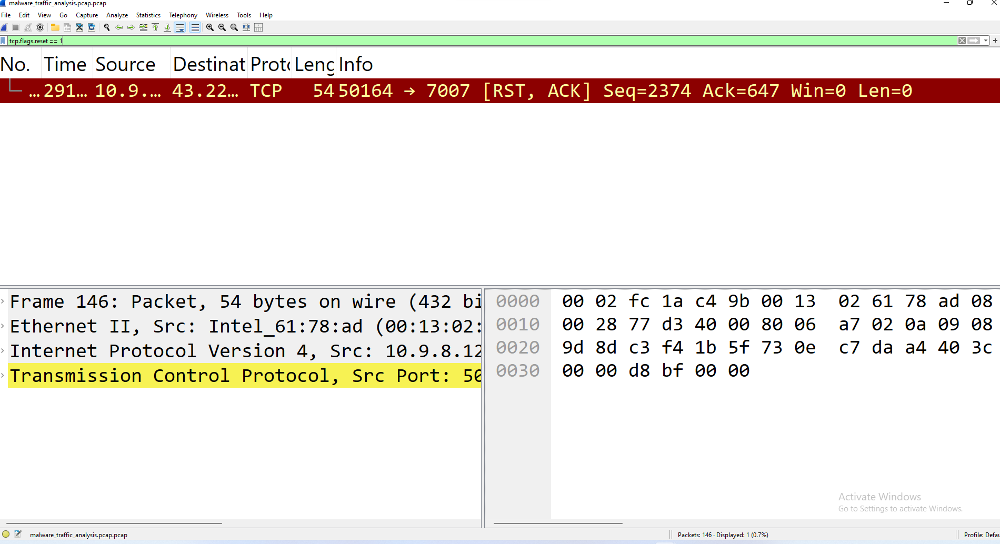
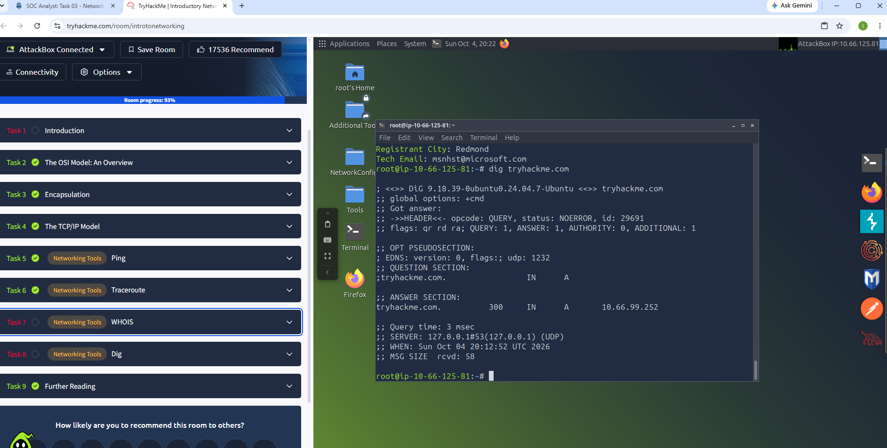

# Network Security Monitoring Lab

This project documents hands-on SOC and network security practice focused on network monitoring, packet analysis, and identifying suspicious traffic.

## Skills Practiced

- IP addressing and source vs. destination analysis
- TCP and UDP traffic
- Common ports and protocols
- DNS and HTTP/HTTPS
- Ping and traceroute
- Wireshark packet analysis
- Normal vs. suspicious traffic identification
- Repeated outbound connection analysis
- Suspicious external IP review
- Basic C2 and beaconing indicators
- SOC-style documentation and evidence collection

## Tools Used

- Wireshark
- Linux
- TryHackMe
- WHOIS
- DNS tools
- Ping
- Traceroute

## Investigation Focus

The lab focused on analyzing network traffic and identifying differences between expected network behavior and potentially suspicious activity.

Indicators reviewed included:

- Repeated outbound connections
- Unknown external IP addresses
- Unexpected ports
- DNS activity
- Connection frequency
- Source and destination relationships

## Key Takeaways

This project strengthened my ability to:

- Analyze network packets
- Identify suspicious network behavior
- Investigate IP-based communication
- Understand common protocols and ports
- Document findings from a SOC analyst perspective

## Evidence

Screenshots and supporting documentation will be added to this repository to demonstrate the hands-on work completed.

## Evidence Screenshots

### Lab Environment Setup

### Wireshark Traffic Analysis

### Unusual Port 7007 Activity

### Suspicious Payload Analysis

### TCP Reset Traffic

### TryHackMe - Introductory Networking

### TryHackMe - Networking Concepts

## Disclaimer

All activities were performed in authorized lab and training environments only.
